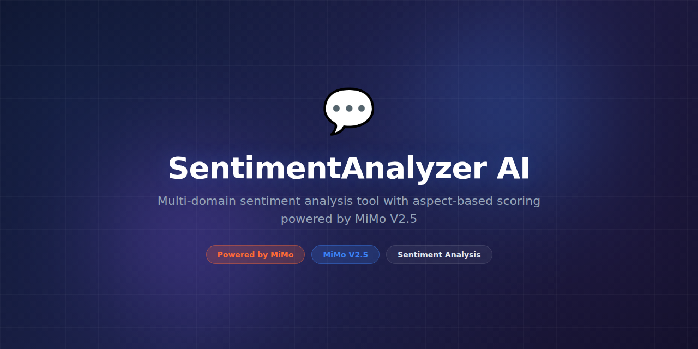

# SentimentAnalyzer-AI



> **Powered by MiMo** — built on top of Xiaomi's [MiMo](https://platform.xiaomimimo.com) reasoning models for advanced sentiment analysis and language understanding.

[](https://opensource.org/licenses/MIT)
[](https://platform.xiaomimimo.com)

---

## Why MiMo

Sentiment analysis seems like a solved problem until you encounter real-world text. Sarcasm ("Oh great, another software update that breaks everything"), mixed sentiment ("The camera is amazing but the battery life is terrible"), domain-specific language ("This stock is sick" means bullish, not negative), and cultural nuance all defeat simple positive/negative classifiers. MiMo V2.5's reasoning capabilities handle these edge cases by understanding context, tone, and intent at a depth that statistical models cannot match.

MiMo's multi-step reasoning is particularly valuable for aspect-based sentiment analysis. When a restaurant review says "The pasta was divine but we waited 45 minutes for a table," MiMo identifies two separate aspects (food quality: positive, wait time: negative) and attributes each sentiment correctly. This granular analysis is essential for businesses that need to understand *what* customers feel, not just *whether* they feel positive or negative overall.

The model also excels at sentiment trend analysis across large corpora. Instead of just scoring individual texts, MiMo can identify emerging sentiment shifts, correlate them with external events, and explain why public opinion is changing. This transforms sentiment analysis from a simple classification task into a strategic intelligence tool for brand management, product development, and market research.

---

## Token Consumption

| Agent | Model | Tokens/run | Frequency | Daily/user |
|---|---|---|---|---|
| Sentiment Classifier | MiMo V2.5 | 1,500 | Per document | ~75,000 |
| Aspect Extractor | MiMo V2.5 | 2,200 | Per document | ~110,000 |
| Trend Analyzer | MiMo V2.5 | 3,500 | Per batch (hourly) | ~84,000 |

---

## What it does

SentimentAnalyzer-AI processes text from reviews, social media, support tickets, and surveys, providing fine-grained sentiment classification (positive, negative, neutral, mixed), aspect-level sentiment extraction, emotion detection, and trend analysis. It handles 20+ languages and excels at sarcasm, irony, and context-dependent expressions.

---

## Why this exists

Businesses sit on mountains of unstructured text feedback — app reviews, support tickets, social mentions, survey responses — that contains critical insights about customer satisfaction and product issues. Basic sentiment tools classify this as positive or negative and miss the nuance. SentimentAnalyzer-AI provides the depth of analysis needed to extract actionable intelligence from text at scale.

---

## Features

- **Fine-grained sentiment** — positive, negative, neutral, and mixed classifications with confidence scores
- **Aspect-based analysis** — extract sentiment per product feature or topic
- **Emotion detection** — joy, anger, frustration, surprise, and more
- **Sarcasm and irony handling** — MiMo's reasoning catches non-literal expressions
- **Multi-language support** — 20+ languages with native-quality analysis
- **Trend tracking** — monitor sentiment shifts over time with change-point detection
- **Batch and streaming** — process historical data or live text streams
- **Customizable taxonomy** — define your own aspects and categories per domain
- **Competitive analysis** — compare sentiment across brands or products
- **Summary generation** — MiMo produces executive summaries of sentiment trends

---

## Tech Stack

- **Python 3.11+** — core runtime
- **MiMo V2.5** — sentiment reasoning and language understanding via Xiaomi API
- **FastAPI** — REST API for real-time analysis
- **Apache Kafka** — streaming text ingestion
- **Elasticsearch** — indexed text storage and search
- **PostgreSQL** — sentiment results and trend storage
- **Plotly** — sentiment trend visualizations
- **Docker** — deployment

---

## Quickstart

```bash
# Clone and install
git clone https://github.com/yuroo-shield/SentimentAnalyzer-AI.git
cd SentimentAnalyzer-AI
pip install -e ".[dev]"

# Set your MiMo API key
export MIMO_API_KEY="your-key-here"

# Analyze a single text
sentiment analyze "The product is great but shipping was painfully slow"

# Batch analyze a CSV of reviews
sentiment batch \
  --input reviews.csv \
  --text-column review_text \
  --aspects "price,quality,delivery,support" \
  --output results.csv

# Start the API server
sentiment serve --port 8080

# Analyze via API
curl http://localhost:8080/api/v1/analyze \
  -H "Content-Type: application/json" \
  -d '{"text": "Absolutely love this app, best purchase this year!", "aspects": true}'

# Generate a trend report
sentiment trends \
  --source reviews.csv \
  --period monthly \
  --output trend_report.html
```

---

## Project Structure

```
SentimentAnalyzer-AI/
├── assets/
│   └── banner.png
├── sentiment/
│   ├── __init__.py
│   ├── classifier.py      # MiMo-powered sentiment classification
│   ├── aspects.py         # Aspect-based sentiment extraction
│   ├── emotions.py        # Emotion detection engine
│   ├── trends.py          # Sentiment trend analysis
│   ├── batch.py           # Batch processing pipeline
│   ├── summary.py         # Executive summary generation
│   ├── api.py             # FastAPI REST endpoints
│   └── config.py          # Configuration management
├── connectors/
│   ├── twitter.py         # Social media ingestion
│   ├── reviews.py         # Review platform connectors
│   └── surveys.py         # Survey data importers
├── tests/
│   ├── test_classifier.py
│   ├── test_aspects.py
│   ├── test_trends.py
│   └── conftest.py
├── docker-compose.yml
├── pyproject.toml
└── README.md
```

---

## Contributing

We welcome contributions! Please see [CONTRIBUTING.md](CONTRIBUTING.md) for guidelines. Run the test suite before submitting PRs:

```bash
# Run tests
pytest tests/ -v

# Run with coverage
pytest tests/ --cov=sentiment --cov-report=html
```

---

## License

This project is licensed under the MIT License — see the [LICENSE](LICENSE) file for details.
